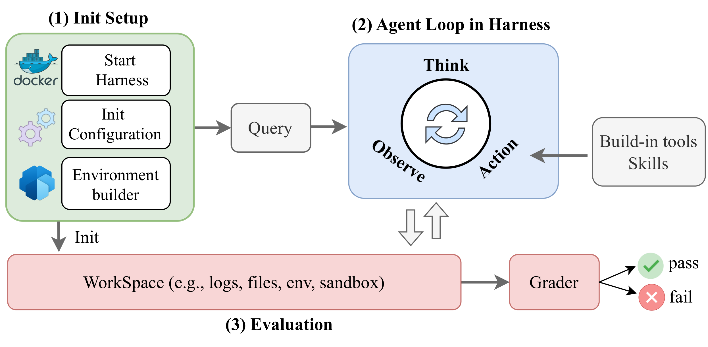
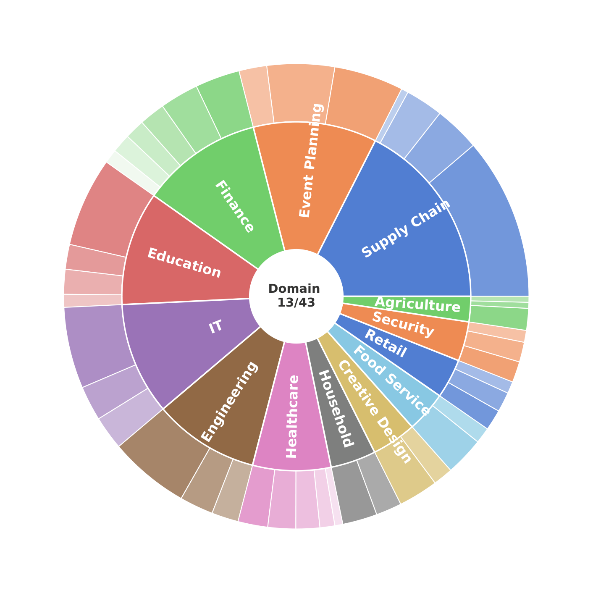
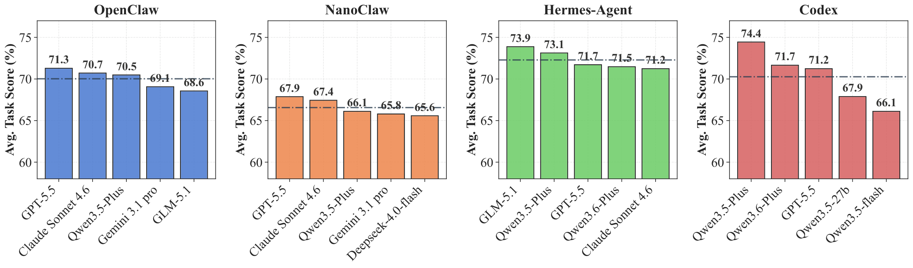

<div align="center">
<h1>ClawBenchPro</h1>
<h3>Benchmarking How Well Agent Harnesses Work</h3>

[](README_zh.md)
[](https://huggingface.co/datasets/ErenJaegerYeager/ClawBenchPro)
[](src/nanoclaw/runner_profiles/)
[](LICENSE)
</div>

---

## 1. 📖 Overview

**ClawBenchPro** evaluates how agent harnesses help language models solve professional workplace tasks. This repository brings together the **1,000-task benchmark**, the **NanoClaw execution and evaluation code**, and adapters for **OpenClaw, Hermes-Agent, and Codex**.

The accompanying manuscript, *ClawBenchPro: Benchmarking How Well Agent Harnesses Work*, describes coverage across **43 professional domains**. Tasks include baseline scenarios, multi-turn interactions, difficult environments, and skill-augmented workflows.

```text
Task YAML + prompts → environment builder → agent harness
                                                 ↓
Evaluation report ← workspace verifier ← final workspace
```

Evaluation focuses on the workspace produced by the agent. Task builders prepare the initial files, the selected harness executes the interaction, and workspace verifiers assess the resulting state. The multi-framework evaluation entry point defaults to workspace-only grading.

**Dataset on Hugging Face:** [ErenJaegerYeager/ClawBenchPro](https://huggingface.co/datasets/ErenJaegerYeager/ClawBenchPro).

<p align="center"></p>
<p align="center"><em>Evaluation workflow from the accompanying paper: initialization, agent harness execution, and workspace verification.</em></p>

---

## 2. 📁 Project structure

```text
ClawBenchPro/
├── README.md                         # English
├── README_zh.md                      # 中文
├── LICENSE
├── data/ClawBenchPro/
│   ├── round_01_aligned_mix_800/      # 800 tasks
│   ├── persona_aligned_mix_200/       # 200 tasks
│   ├── dataset_index.csv
│   └── materialize_assets.py
├── examples/
│   ├── smoke_test.py
│   └── verify_data.py
├── docs/
│   ├── data-format.md
│   └── research-notes.md
└── src/nanoclaw/
    ├── nanoclaw/                     # Runtime, task loading, evaluation
    ├── scripts/                      # Batch execution and reporting
    ├── runner_profiles/              # OpenClaw / Hermes / Codex
    ├── docker/                       # External harness adapters
    └── tests/                        # Runner regression tests
```

---

## 3. 🧩 Main components

### 3.1 Benchmark dataset

| Package | Base | Multi-turn | Hard | Skills | Total |
| --- | ---: | ---: | ---: | ---: | ---: |
| `round_01_aligned_mix_800` | 200 | 200 | 200 | 200 | 800 |
| `persona_aligned_mix_200` | 50 | 50 | 50 | 50 | 200 |
| **Total** | **250** | **250** | **250** | **250** | **1,000** |

Each package contains task YAML, Markdown prompts, workspace builders, optional skills, verifier JSONL, evaluation manifests, and provenance records. The 800-task package uses `multi_turn_aligned`, `hard_aligned`, and `skills_aligned` as group identifiers. The persona package uses `multi_turn`, `hard`, and `skills`.

Workspaces are distributed in compact builder form and materialized during execution. See the [data format](docs/data-format.md) and [dataset card](data/ClawBenchPro/README.md) for details.

<p align="center"></p>
<p align="center"><em>Domain coverage reported in the paper: nine strategic areas are expanded into 43 scenario domains.</em></p>

### 3.2 Execution and evaluation

| Component | Role | Source |
| --- | --- | --- |
| Task loader | Resolves task configuration and prompts | [task_loader.py](src/nanoclaw/nanoclaw/task_loader.py) |
| Batch runner | Prepares and executes task runs | [batch_runner.py](src/nanoclaw/nanoclaw/batch_runner.py) |
| NanoClaw loop | Runs model reasoning and tool interactions | [core_loop.py](src/nanoclaw/nanoclaw/core_loop.py) |
| Docker adapters | Connect external frameworks to the benchmark | [docker/](src/nanoclaw/docker/) |
| Workspace evaluation | Grades runs against task verifiers | [evaluation script](src/nanoclaw/scripts/evaluate_workplace_trace_tasks.py) |
| Experiment entry point | Runs framework/model combinations and evaluation | [subset runner](src/nanoclaw/scripts/run_clawbenchpro_subset.py) |

### 3.3 Supported harnesses

| Harness | Execution | Configuration |
| --- | --- | --- |
| NanoClaw | Built-in Python runner | [Runtime documentation](src/nanoclaw/README.md) |
| OpenClaw | Docker adapter | [Profile](src/nanoclaw/runner_profiles/openclaw.yaml) · [Adapter guide](src/nanoclaw/docker/openclaw-runner/README.md) |
| Hermes-Agent | Docker adapter | [Profile](src/nanoclaw/runner_profiles/hermes.yaml) |
| Codex | Docker adapter | [Profile](src/nanoclaw/runner_profiles/codex.yaml) · [Adapter guide](src/nanoclaw/docker/codex-runner/README.md) |

Model and endpoint compatibility depends on the selected harness. Configure the relevant profile and provider environment variables before comparing frameworks.

<p align="center"></p>
<p align="center"><em>Illustrative cross-harness comparison reproduced from the paper's released figure.</em></p>

---

## 4. 🚀 Reproduce an evaluation

### 4.1 Download and install

Requirements: **Python 3.12.10 or later**, **uv**, **Git LFS**, and Docker for the external harness adapters. The clone URL below remains valid through GitHub's repository-rename redirect.

```bash
# Git LFS is required for the benchmark JSONL files.
git lfs install
git clone git@github.com:Herrieson/nanoclaw.git ClawBenchPro
cd ClawBenchPro
git lfs pull
python3 examples/verify_data.py

cd src/nanoclaw
uv sync
uv run python -m unittest discover -s tests -p 'test_*.py'
```

### 4.2 Inspect and run one task

`--list-only` prints the selected task without calling a model. `--run` executes one task and requires model credentials. Use the same `uv` environment as the runner:

```bash
# Run from ClawBenchPro/src/nanoclaw.
uv run python ../../examples/smoke_test.py --list-only

export OPENAI_API_KEY="<your-api-key>"
export NANOCLAW_MODEL="<your-model>"
# Optional: OpenAI-compatible endpoint
# export NANOCLAW_BASE_URL="https://your-endpoint/v1"

uv run python ../../examples/smoke_test.py --run
```

The example selects the first task in `round_01_aligned_mix_800`. Pass `--dataset persona_aligned_mix_200` or `--task <task-id>` to change the selection. Outputs go to repository-root `results/smoke/`. This example executes a task; use the suite workflow below for execution followed by grading.

### 4.3 Compare frameworks

Build the adapters you intend to use, then run the benchmark matrix:

```bash
# Run from ClawBenchPro/src/nanoclaw.
docker build -t nanoclaw-runner-openclaw:latest docker/openclaw-runner
docker build -t nanoclaw-runner-hermes:latest docker/hermes-runner
docker build -t nanoclaw-runner-codex:latest docker/codex-runner

uv run python scripts/run_clawbenchpro_subset.py \
  ../../data/ClawBenchPro \
  --datasets persona_aligned_mix_200 \
  --runners nanoclaw openclaw hermes codex \
  --models "$NANOCLAW_MODEL" \
  --workers 2 --eval-workers 4 \
  --components workplace
```

The command runs **all 200 tasks for each of four frameworks**; it is not a one-task smoke test. For a single-framework experiment, use `--runners nanoclaw`. Select `round_01_aligned_mix_800` for the other package, or omit `--datasets` to run both. Use `--no-run-tasks` to grade existing runs without executing them again.

### 4.4 Inspect results

```bash
# Run from ClawBenchPro/src/nanoclaw.
uv run python scripts/summarize_clawbenchpro_results.py results/clawbenchpro_eval
```

Suite runs are stored under `src/nanoclaw/results/clawbenchpro_runs/`; evaluation JSON, CSV, and summaries are under `src/nanoclaw/results/clawbenchpro_eval/`, organized by package, runner, and model. Generated results are ignored by Git.

---

## 5. 🔎 Data integrity and research scope

`examples/verify_data.py` checks the two portable subset checksum manifests. The packaged files passed **7,756 checksum checks** at assembly time. This verifies file integrity; it does not establish model performance or validate every task's semantics.

The repository provides evaluation artifacts and framework adapters. It does not bundle the manuscript's experimental run outputs or a reproduced leaderboard. See [research notes](docs/research-notes.md) for the artifact map.

---

## 6. 📄 License and acknowledgments

The runner and dataset retain their original **MIT** license and copyright notices: [repository license](LICENSE), [runner license](src/nanoclaw/LICENSE), and [dataset license](data/ClawBenchPro/LICENSE). External frameworks retain their own licenses. We acknowledge the NanoClaw runtime and the OpenClaw, Hermes-Agent, and Codex ecosystems used by the adapters.
